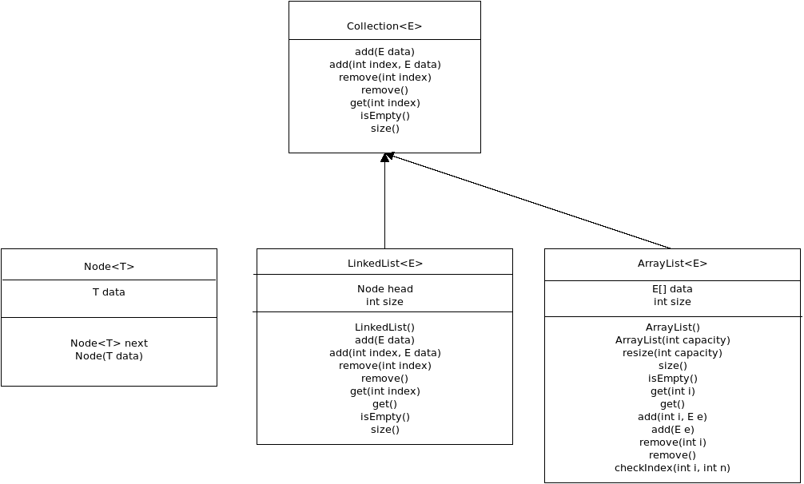
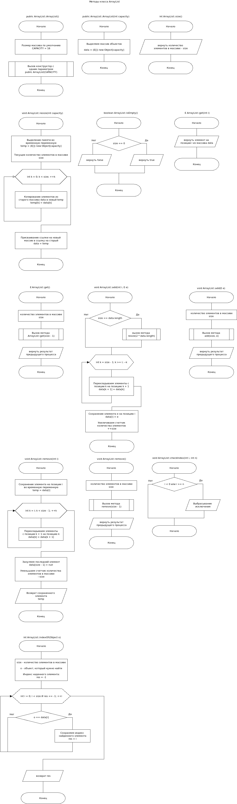
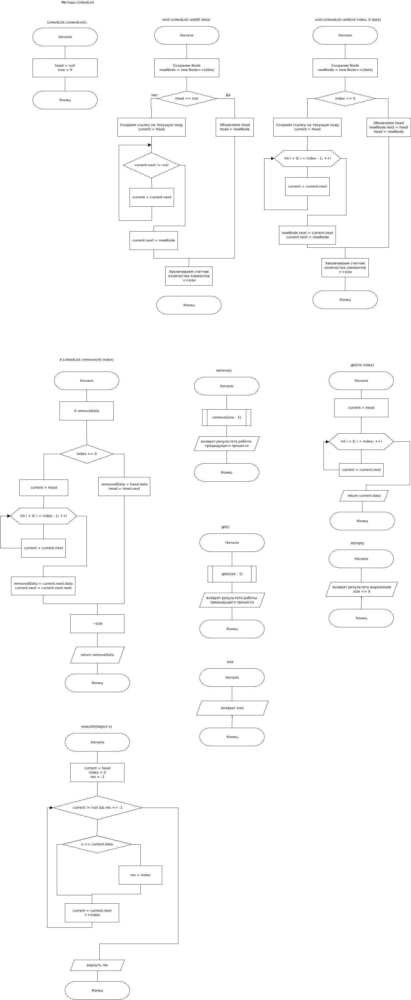

# Collections

Необходимо создать свой собственный интерфейс для модуля collections и реализовать LinkedList и ArrayList.
Создать блок-схемы описывающие алгоритм выполнения функций и схему описывающую структуру данных.

**Загрузить блок-схемы и структуру необходимо в день выдачи задания! (22.03.2025)**

Так же необходимо покрыть методы LinkedList и ArrayList unit тестами с помощью JUnit5.

## Result:
### Classes

### ArrayList:

### LinkedList:

